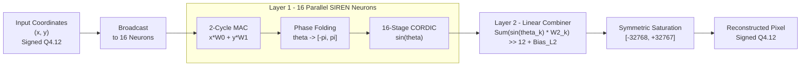

# ASIC-Oriented SIREN Hardware Accelerator & Arbitrary-Scale Image Upscaler

A synthesizable, pipelined SystemVerilog hardware accelerator for Implicit Neural Representation (INR) decoding and continuous-domain super-resolution using a 2-layer Sinusoidal Representation Network (SIREN).

---

## 1. Overview

Conventional digital image decoders rely on discrete pixel matrices stored in frame buffers, requiring bilinear, bicubic, or CNN-based interpolation to upscale. 

In contrast, this hardware accelerator models visual signals as a continuous coordinate mapping function:

$$f_\theta(x, y) \rightarrow \text{Pixel Intensity}$$

Because $(x, y) \in [-1.0, 1.0]$ are fed as continuous coordinate values rather than discrete array indices, the architecture functions as a native **arbitrary-scale image upscaler**. You can generate higher resolution outputs ($2\times$, $4\times$, $8\times$) simply by sampling the coordinate space at a finer fixed-point step size $\Delta$ without altering the hardware datapath or inserting interpolation memory buffers.

---

## 2. Key Architectural Features

* **Parallel 16-Neuron Hidden Layer:** Implemented via SystemVerilog `generate` blocks to evaluate 16 parallel dot products simultaneously per clock cycle.
* **16-Stage Pipelined CORDIC Engine:** Evaluates continuous trigonometric activations ($\sin(\cdot)$ / $\cos(\cdot)$) on-the-fly in vector-rotation mode, completely eliminating SRAM lookup tables.
* **Gain Factor Calibration:** Pre-scales initial coordinate seeds with $1/K \approx 0.607252935$ to neutralize the CORDIC vector growth factor ($K \approx 1.64676$).
* **Quadrant Phase Folder:** Normalizes unbounded angular inputs from $[-30\pi, +30\pi]$ into the CORDIC convergence zone of $[-\pi, \pi]$ using modulo arithmetic.
* **Q4.12 Fixed-Point Datapath:** Arithmetic datapath optimized for fixed-point DSP/ASIC targets with signed right-shifts (`>>> 12`) to preserve dynamic range.
* **Layer 2 Reduction Tree & Saturation:** Multi-channel accumulation logic with extended guard bits to avoid overflow roll-over, clipping cleanly to `16'sh7FFF` ($+7.999$) and `16'sh8000` ($-8.000$).

---

## 3. Hardware Datapath
## Hardware Architecture

The proposed accelerator implements a compact **SIREN-based coordinate-to-pixel reconstruction architecture** using fixed-point arithmetic, parallel neurons, phase folding, and a pipelined CORDIC sine engine.



## 4. Latency & Timing Profile

| Pipeline Stage | Cycles | Description |
| :--- | :---: | :--- |
| **Coordinate MAC** | 2 | Accumulates $x \cdot w_0 + y \cdot w_1 + \text{bias}$ |
| **Omega-0 Scaler** | 1 | Scales intermediate sum by $\omega_0 = 30.0$ |
| **Phase Folder** | 1 | Angle reduction to $[-\pi, \pi]$ |
| **CORDIC Engine** | 16 | 16 cascaded shift-and-add rotation stages |
| **Layer 2 Combiner** | 1 | Registered sum-of-products reduction + saturation |
| **Total Pipeline Latency** | **21 Cycles** | Fully pipelined; throughput is 1 pixel per coordinate pair |

---

## 5. Verification & Benchmark Results

The accelerator was validated through a closed-loop Python co-simulation flow. Output hex data dumped by Icarus Verilog was converted back to normalized floating-point values and benchmarked against standard reference images on a $32 \times 32$ grid:

| Metric | Floating-Point Golden Model | RTL Hardware Output (Q4.12) |
| :--- | :---: | :---: |
| **Peak Signal-to-Noise Ratio (PSNR)** | 28.52 dB | **28.49 dB** |
| **Structural Similarity Index (SSIM)** | 0.9950 | **0.9950** |
| **Data Format** | IEEE-754 64-bit Float | Signed Q4.12 Fixed-Point |
| **Quantization Noise Floor** | Ideal ($0\text{ dB}$) | **-28.5 dB** (Matches LSB truncation) |

---

## 6. Directory Structure

```text
├── doc/
│   ├── datapath_architecture.png   # Block diagram
│   └── reconstructed_output.png    # Rendered hardware output
├── rtl/
│   ├── inr_pkg.sv                  # Package: Constants, Q-formats, and angle LUT
│   ├── mac_unit.sv                 # 2-cycle coordinate MAC accumulator
│   ├── siren_scaler.sv             # Multiplier for omega_0 (30.0)
│   ├── phase_folder.sv             # Angle reduction module
│   ├── cordic_stage.sv             # Elementary shift-and-add rotation stage
│   ├── cordic_wrapper.sv           # 16-stage unrolled CORDIC pipeline
│   ├── siren_neuron.sv             # Single-neuron SIREN module
│   └── siren_network.sv            # 16-neuron parallel layer + L2 combiner
├── sim/
│   ├── tb_image_recon_16n.sv       # Top-level testbench
│   ├── coords.hex                  # Input test coordinates
│   ├── layer1_weights.hex          # Layer 1 weights and biases
│   ├── layer2_weights.hex          # Layer 2 weights and bias
│   └── out_pixels.hex              # Raw RTL simulation hex output
├── sw/
│   ├── train_siren.py              # PyTorch model training and hex exporter
│   └── evaluate_metrics.py         # Hex parser, PSNR/SSIM, and rendering script
├── run_sim.sh                      # Shell script for automated compile and run
└── README.md
